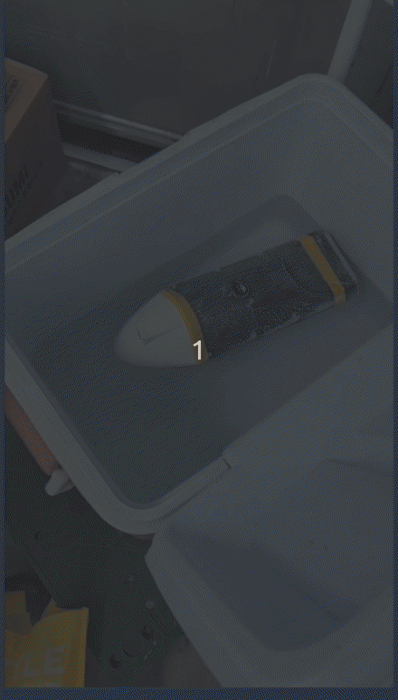
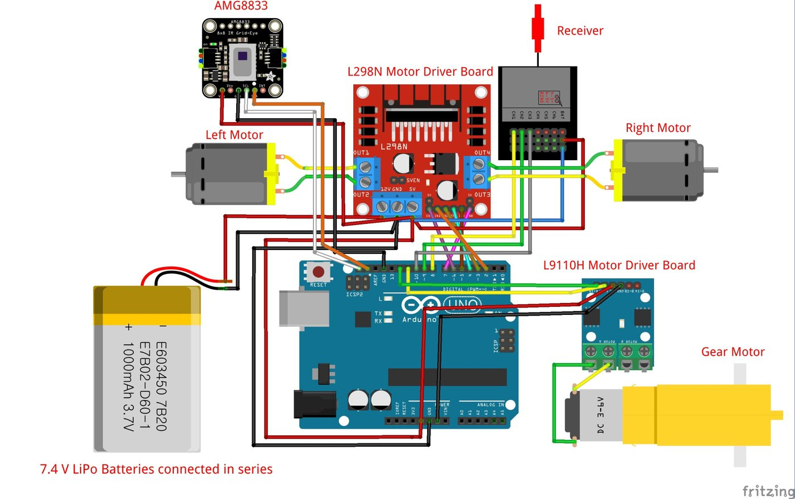
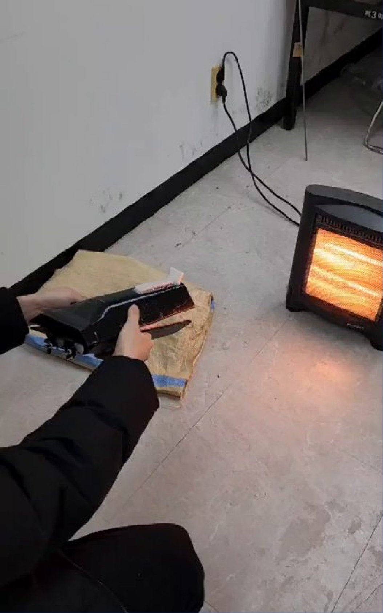
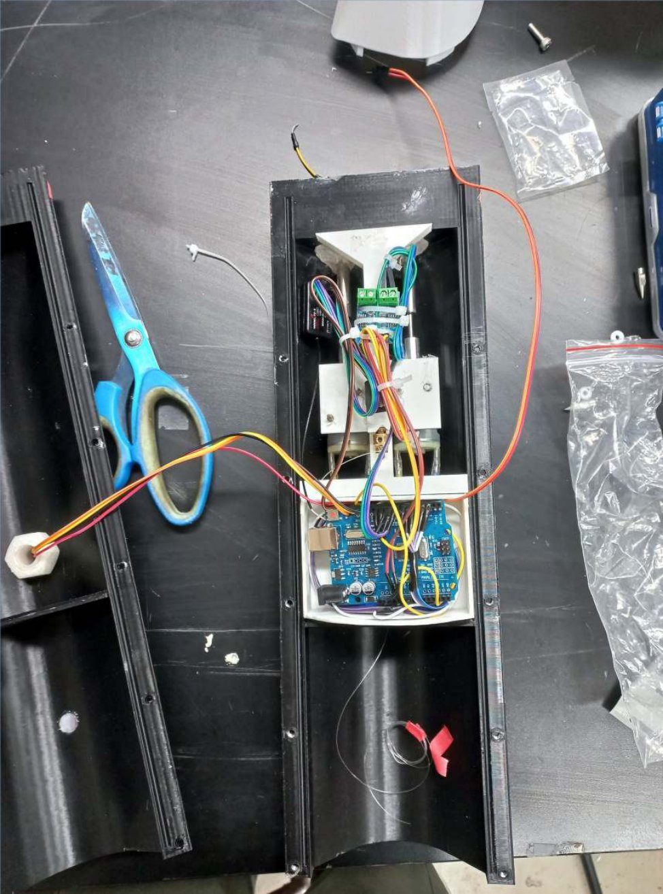
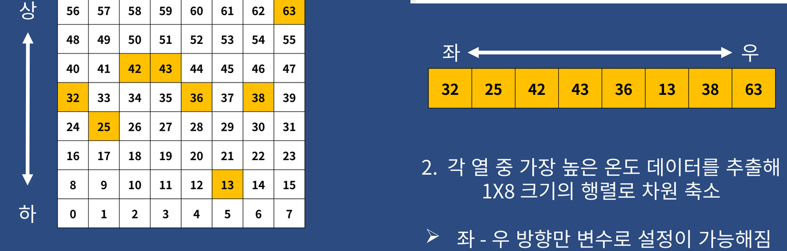

# 열감지 추적 구명튜브 전달장치 — Arduino 제어 코드

물에 빠진 사람의 체온을 열화상 센서로 찾아 그쪽으로 스스로 다가가는 소형 보트의 제어 코드입니다. 보트는 발사장치로 사람 근처에 던져 넣고, 구명튜브를 실어 전달합니다.
목표는 비싸고 조작이 어려운 상용 구조장비 대신, 비전문가도 바로 쓸 수 있는 저비용 휴대형 장치였습니다.

> 출처: 충남대 기계공학부 졸업프로젝트(캡스톤디자인, 3인 팀, 24.08~25.08). 본인 담당은 좌우 DC 모터 차동 제어 · 아두이노 회로 구성입니다. 원본 `.ino`가 남아 있지 않아, 졸업논문에 실린 코드(Figure 16)를 그대로 옮겨 재구성했습니다. 이 저장소에서 바꾼 것은 줄바꿈 복원과 주석뿐입니다. 더 많은 제작 과정·사진은 [포트폴리오 사이트](https://gwanhuigim.github.io), 다른 프로젝트는 [GitHub 프로필](https://github.com/gwanhuiGIM)에 있습니다.

<table align="center"><tr>
  <td align="center"><br><sub>발사 시험</sub></td>
  <td align="center"><br><sub>수조 시험</sub></td>
</tr></table>

📄 [창의적종합설계 발표 자료(PDF, 47쪽)](https://github.com/gwanhuiGIM/grad_proj/releases/download/presentation/grad_creative_design.pdf) · [심화종합설계 발표 자료(PDF, 48쪽)](https://github.com/gwanhuiGIM/grad_proj/releases/download/presentation/grad_advanced_design.pdf) — 세부 기술 발표 자료

> **핵심 설계**: 8bit Arduino Uno 하나가 센서 처리와 모터 구동을 모두 맡기 때문에, 8×8 열화상 값을 열(column)별 최고 온도만 남긴 1×8로 줄여 "가장 뜨거운 쪽이 왼쪽인지 오른쪽인지"만 판정합니다. 조향은 방향키 대신 좌우 DC 모터의 PWM 차이로 합니다(착수 충격에 방향키가 부서질 위험을 피하려는 선택).

```
 RC 수신기 3채널 ──pulseIn──┐
                            ├─ 3채널 모두 0? ── 예 ─▶ 자율: AMG8833 8×8 ─▶ 상하 반전 ─▶ 열별 최고온도 1×8
                            │                                           ─▶ 최고 열 위치 → 방향 5단계 ─▶ 좌우 PWM
                            └─────────────── 아니오 ─▶ 수동: 조향·속도 채널 → 좌우 PWM
                                                         특수기능 채널 → 구명튜브 팽창 모터
 좌우 PWM ─▶ L298N ─▶ 좌우 추진 DC 모터
```

## 목차

_주제별 바로가기입니다. 본문 배치 순서와 다를 수 있습니다._

- **개요·구조**: [환경 · 장비](#환경--장비) · [저장소 구성](#저장소-구성) · [무엇을 할 수 있나](#무엇을-할-수-있나) · [시스템 구조](#시스템-구조)
- **돌려 보기**: [빌드 · 업로드](#빌드--업로드)
- **검증·한계·참고**: [한계](#한계) · [검증](#검증) · [License](#license)

## 환경 · 장비

<details>
<summary>장비 표 · 핀맵 · 회로도</summary>

| 구분 | 내용 |
|:--|:--|
| 제어 보드 | Arduino Uno |
| 센서 | AMG8833 8×8 열화상 (I2C, A4/A5) |
| 모터 드라이버 | L298N — 좌우 추진 DC 모터 2개 |
| 기타 모터 | 구명튜브 팽창용 DC 모터 (핀 11·12, L9110H 드라이버 경유) |
| 조종 | RC 수신기 3채널 (핀 8 조향 · 9 속도 · 10 특수기능) |
| 전원 | 7.4V 리튬폴리머 배터리 |

L298N 핀: IN1~IN4 = 2·3·4·5, ENA = 6, ENB = 7.

<p align="center">
  <br>
  <sub>회로도 (Fritzing)</sub>
</p>

</details>

## 저장소 구성

**핵심 코드 바로가기**

| 파일 | 하는 일 | 설명 위치 |
|:--|:--|:--|
| ⭐ **[`lifeboat_control.ino` · `loop()`](lifeboat_control/lifeboat_control.ino#L183-L203)** | RC 3채널 펄스를 읽어 자율/수동 분기 | [시스템 구조](#시스템-구조) |
| **[`lifeboat_control.ino` · `processIRSensor()`](lifeboat_control/lifeboat_control.ino#L80-L114)** | 8×8 열화상 → 상하 반전 → 열별 최고 1×8 → 방향 5단계 판정 | [시스템 구조](#시스템-구조) |
| **[`lifeboat_control.ino` · `autonomousDrive()`](lifeboat_control/lifeboat_control.ino#L116-L134)** | 방향별 좌우 PWM 쌍을 `motorControl()`로 L298N에 출력 | [시스템 구조](#시스템-구조) |
| **[`lifeboat_control.ino` · `manualDrive()`](lifeboat_control/lifeboat_control.ino#L136-L170)** | 조향·속도 채널 → 좌우 PWM, 특수기능 채널 → 구명튜브 팽창 | [시스템 구조](#시스템-구조) |

```
lifeboat_control/lifeboat_control.ino   ★ 제어 코드 전체 (헤더에 회로·핀맵, 끝에 알려진 특이점)
docs/images/                            README 그림 (발표 자료에서 잘라 온 사진·도식)
README.md
★ = 위 "핵심 코드 바로가기" 파일이 있는 곳
```
보트·발사장치 CAD, 논문, 발표 자료 원본은 팀 공동 산출물이라 이 저장소에 넣지 않았고, `docs/images/`에는 발표 자료에서 사진·도식 일부만 잘라 넣었습니다.

## 무엇을 할 수 있나

| 모드 | 들어가는 조건 | 보트가 하는 일 |
|:--|:--|:--|
| 자율 | RC 3채널 신호가 모두 없음(`pulseIn` 결과 0) | 열화상에서 가장 뜨거운 열 방향으로 좌우 모터 출력을 달리해 조향 |
| 수동 | RC 신호가 하나라도 있음 | 조향·속도 스틱으로 직진·좌/우회전·정지 |
| 구명튜브 팽창 | 수동 모드에서 특수기능 채널 ≥ 1500µs | 팽창 모터를 3초씩 양방향 구동한 뒤 제어 루프 정지 |

<p align="center">
  <br>
  <sub>열원(히터) 방향 추적 시험, 지상. 프로젝트 당시 원본 코드로 진행</sub>
</p>

운영 시나리오(논문 기준)는 사람에게서 먼 거리는 RC로 조종하고, 가까워지면 조종기를 놓아 자율 추적으로 넘기는 방식입니다. 코드에는 거리 판단이 없고, 모드는 RC 신호 유무로만 바뀝니다.

## 시스템 구조

<details>
<summary>함수별 동작 · 선체 내부 사진 · 8×8→1×8 도식</summary>

모든 로직은 [`lifeboat_control/lifeboat_control.ino`](lifeboat_control/lifeboat_control.ino) 한 파일, `loop()` 하나에서 돕니다(주기 약 100ms + `pulseIn` 대기).

<p align="center">
  <br>
  <sub>선체 내부 — Arduino Uno 한 장이 센서 처리와 모터 구동을 모두 맡음</sub>
</p>

- **인지** `processIRSensor()`: AMG8833(I2C)에서 8×8 온도를 읽고 장착 방향에 맞춰 상하 반전한 뒤, 열별 최고 온도로 1×8을 만들고 최고 온도 열 번호(`max_index`)를 구합니다.

<p align="center">
  <br>
  <sub>8×8 값을 열별 최고 온도만 남긴 1×8로 축소 (숫자는 셀 번호, 노란 칸은 각 열의 최고 온도 셀)</sub>
</p>

- **판정**(`processIRSensor()` 끝부분): `max_index` 7 → 급좌, 6 → 좌, 4~5 → 직진, 2~3 → 우, 0~1 → 급우.
- **구동** `autonomousDrive()` / `motorControl()`: 방향별로 좌우 모터에 (0,255)·(200,255)·(255,255)·(255,200)·(255,0)을 줍니다. 회전 방향 핀(IN1~IN4)은 항상 전진입니다.
- **수동** `manualDrive()`: 속도 채널 1730~2100µs 구간에서 속도를 160~255로 매핑하고, 조향 채널로 직진·좌·우를 고릅니다. 2220µs 이상은 최고속, 그 밖은 정지입니다.

</details>

## 한계

- 원본이 아닌 논문 게재 코드의 재구성본입니다. 당시 보드에 올린 코드와 세부가 다를 수 있습니다.
- 오픈루프 PWM 제어입니다(속도·방향 피드백 없음).
- ENB(핀 7)가 Uno의 PWM 핀이 아니라서 우회전(255,200)과 직진(255,255) 출력이 같습니다. 방향 5단계 중 실제로 구분되는 출력은 4가지입니다.
- 구명튜브 팽창 뒤 추진 모터가 자동으로 멈추지 않습니다(아래 빌드 · 업로드 절의 정지 방법 참고).

<details>
<summary>코드 세부 특이점</summary>

- 자율 모드 판정의 0은 `pulseIn` timeout 결과라, RC 신호가 없을 때 채널마다 최대 1초씩 대기가 생길 수 있습니다.
- `setupPins()`가 정의돼 있지만 `setup()`에서 호출되지 않습니다(논문 원문 그대로).
- 수동 모드 속도 판정 범위(1730~2100µs)와 `map()` 상한(2220µs)이 서로 다릅니다.
</details>

## 빌드 · 업로드

```bash
arduino-cli lib install "Adafruit AMG88xx Library"         # Adafruit BusIO도 의존성으로 함께 설치됨
arduino-cli compile --fqbn arduino:avr:uno lifeboat_control
arduino-cli upload -p /dev/ttyACM0 --fqbn arduino:avr:uno lifeboat_control   # 포트는 환경에 맞게
```
Arduino IDE에서는 `lifeboat_control/lifeboat_control.ino`를 열고 보드를 Uno로 고르면 됩니다.

**정지 방법**: 수동 모드에서 추진을 멈추는 코드 경로는 속도 채널이 정지 구간에 있을 때뿐입니다. 구명튜브 팽창 시퀀스가 끝나면 `while(1)`로 루프가 멈추는데, 이때 좌우 추진 모터는 직전 출력을 유지하므로 배터리를 분리하거나 보드를 리셋해야 멈춥니다. 센서 초기화에 실패하면 `setup()`의 `while(true)`에서 멈추는데, 이때는 모터를 구동하기 전입니다. 또 RC 조종기를 끄거나 신호가 끊겨 3채널이 모두 0이 되면 정지가 아니라 자율 추적으로 넘어가므로, 조종기를 끄는 것은 정지 방법이 아닙니다.

## 검증

- `arduino-cli compile --fqbn arduino:avr:uno` 통과 (flash 8118B/25%, RAM 1047B/51%, Adafruit AMG88xx Library 1.3.2, 2026-10-06).
- 업로드 명령과 이 재구성본의 실기 구동은 확인하지 않았습니다. 프로젝트 당시 실기 시연은 원본 코드로 했습니다.

## License

이 저장소의 코드와 문서에는 라이선스를 부여하지 않았습니다(All rights reserved). 의존 라이브러리 Adafruit AMG88xx Library는 저장소에 포함하지 않으며 자체 라이선스를 따릅니다.
